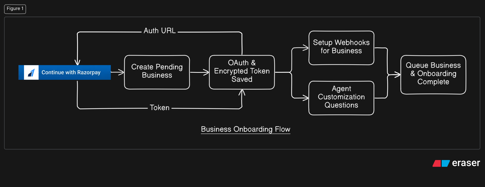
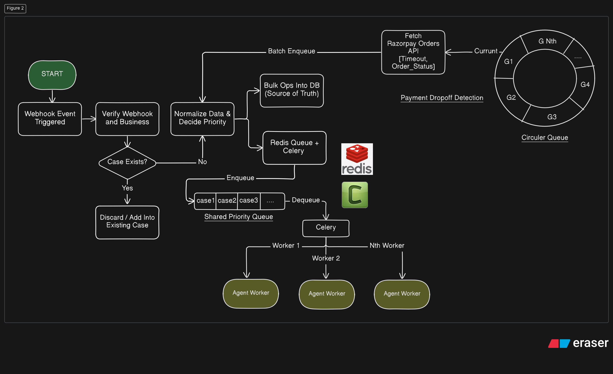
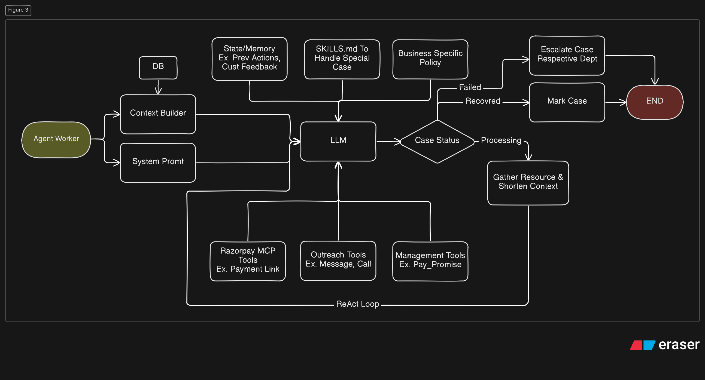
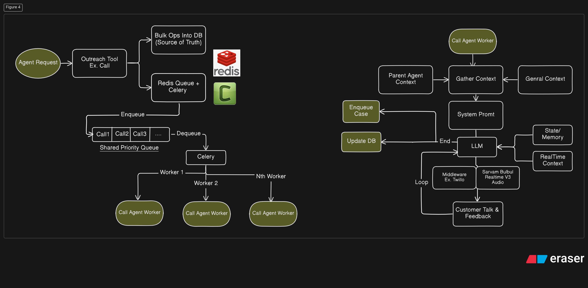

# Razorpay Payment Recovery Agent
# OpenAPI - https://razopayagent-production.up.railway.app/docs
## Architecture

The **Razorpay Payment Recovery Agent** is an event-driven, asynchronous AI system that detects payment drop-offs, creates recovery cases, and autonomously takes recovery actions through Razorpay and customer communication tools.

### Major Technologies

* **FastAPI** — Backend APIs and webhook handling
* **PostgreSQL** — Persistent database and source of truth
* **SQLAlchemy** — Database interaction
* **Alembic** — Database migrations
* **Redis** — Queue/broker for asynchronous processing
* **Celery** — Background workers and task execution
* **LangGraph** — Stateful agent workflow and orchestration
* **LLM** — Reasoning and decision-making
* **Razorpay OAuth & Webhooks** — Business authorization and payment events
* **Razorpay MCP Tools** — Payment-related agent actions
* **Outreach Tools** — Customer calls/messages
* **Agent State & Memory** — Previous actions, feedback, and case context

The architecture is divided into four major stages:

1. **Business Onboarding**

Before the recovery agent can operate for a business, the business authorizes the system through Razorpay OAuth. The system creates the business, securely stores the encrypted authorization token, configures webhooks, collects agent customization, and completes onboarding.

2. **Payment Drop-off Detection**

Razorpay webhook events are verified and associated with a business. Existing cases are updated while new cases are normalized, prioritized, persisted in PostgreSQL, and pushed to Redis/Celery for asynchronous processing.

3. **Agent Worker**

Celery workers process recovery cases using a **LangGraph-based agent**. The agent builds context from the database, state/memory, business policies, and skills, then uses the LLM with Razorpay, outreach, and management tools. The agent continues until the case is recovered, requires further processing, or must be escalated.

4. **Outreach Agent**

Customer outreach is handled asynchronously through dedicated workers. The outreach agent gathers the parent case context, general context, memory, and real-time information, then uses the LLM with voice/messaging tools to communicate with the customer and feed the result back into the recovery workflow.
